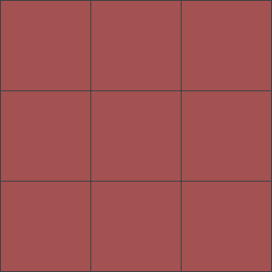
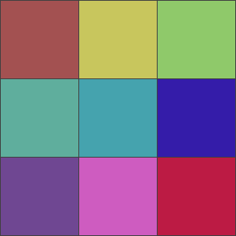
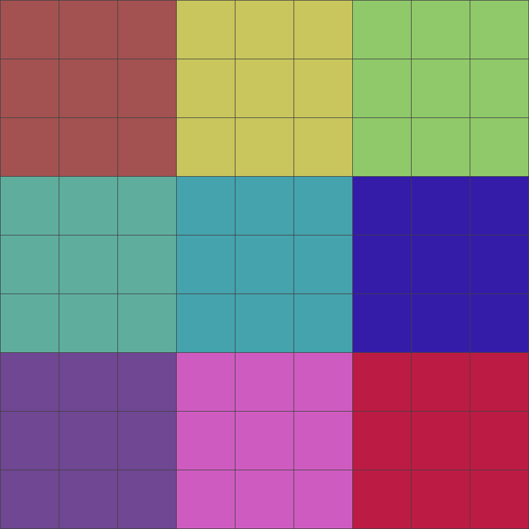

# magnifier

一个普通的放大镜

## 如上所述

[测试用例](./test1.html)

## 引入方式

### `script`

```html
<script src="https://magnifier.oulaoula.cn/dist/magnifier.js"></script>
```

### [`module`](https://www.npmjs.com/package/oulaoula-magnifier)

```
    npm install magnifier --save
```

## 使用方式

``` ts
    // 新版扩散
    drawMagnifier(magCtx, bgCtx, bounds);
    // 系统缩放
    drawSystemMagnifier(magCtx, canvasSize, canvasImg, bounds);
```

## `drawMagnifier` - 绘制放大镜
- `magCtx` CanvasRenderingContext2D - 放大镜所在画布
- `bgCtx` CanvasRenderingContext2D - 背景所在画布
- `bounds` [IBounds](#bounds) - 放大区域

## `drawSystemMagnifier` - 使用系统API绘制放大镜
- `magCtx` CanvasRenderingContext2D - 放大镜所在画布
- `size` ISize - 背景尺寸
- `image` Image - 背景图
- `bounds` [IBounds](#bounds) - 放大区域

### <span id="bounds">`IBounds`</span> - 区域
- `width` number
- `height` number
- `x` number
- `y` number

## 像素放大镜原理说明

画布中的图像由像素的矩阵填充而成，我们只需要将画布中每一块像素向周围扩散n倍，就能达到放大画布的效果，如图(其中一个方格代表一个像素点)：  
 
=>



=>


### 注意：getImageData获取的像素矩阵排列如下
``` js
  const imageData = ctx.getImageData(0, 0, 1, 1);
  const [red, green, blue, alpha] = imageData.data;
  console.log(
    '红色:', red,
    '绿色:', green,
    '蓝色:', blue,
    '透明度:', alpha,
  );
```

## 例子

```js
// node
// import { drawImageByUrl, drawSystemMagnifier } from 'magnifier';

const canvas = document.querySelector("canvas");
const ctx = canvas.getContext("2d");
const bgUrl = "https://magnifier.oulaoula.cn/bg.jpeg";

const magnifier = document.createElement("canvas");
magnifier.style.position = "fixed";
magnifier.style.right = "0";
magnifier.style.bottom = "0";
magnifier.width = 190;
magnifier.height = 190;
const magCtx = magnifier.getContext("2d");

document.body.appendChild(magnifier);

let img;

drawImageByUrl(ctx, canvas, bgUrl, (res) => {
  img = res;
});

canvas.onmousemove = function (e) {
  const { offsetX, offsetY } = e;
  window.requestAnimationFrame(function () {
    const bounds = {
      x: offsetX - 9,
      y: offsetY - 9,
      width: 19,
      height: 19,
    };
    // 新版扩散
    drawSystemMagnifier(magCtx, canvas, img, bounds);
  });
};
```
